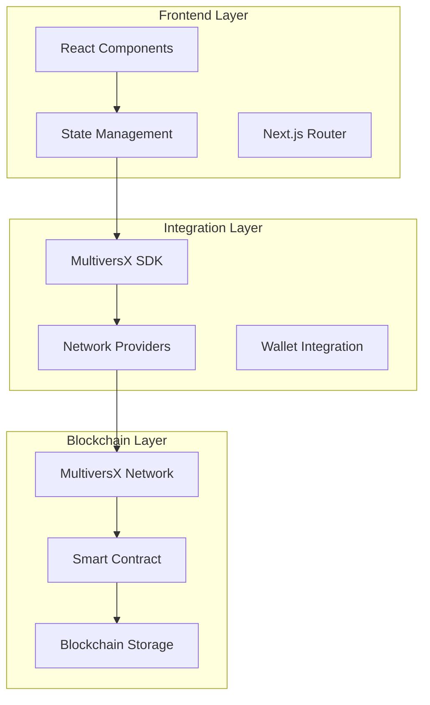

# 🏗️ Arquitetura Técnica - ChainBallotX

Este documento detalha a arquitetura técnica completa do sistema, fluxos de dados, padrões de design e decisões arquiteturais.

## 📊 Visão Geral da Arquitetura



## 🎯 Princípios Arquiteturais

### **1. Separação de Responsabilidades**
- **Presentation Layer**: Componentes React + UI/UX
- **Business Logic**: Services + Hooks personalizados
- **Data Layer**: Blockchain integration + State management

### **2. Unidirectional Data Flow**
```
User Action → Component → Service → Blockchain → State Update → UI Re-render
```

### **3. Composition over Inheritance**
- Hooks personalizados para lógica reutilizável
- Higher-Order Components para funcionalidades transversais
- Componentes compostos para flexibilidade

### **4. Type Safety First**
- TypeScript em 100% do código
- Interfaces bem definidas
- Validação em tempo de compilação

---

## 📁 Estrutura Detalhada do Projeto

```
src/
├── app/                        # Next.js App Router
│   ├── layout.tsx             # Root layout + providers
│   ├── page.tsx               # Homepage
│   ├── proposals/             # Proposals module
│   │   ├── page.tsx          # List + voting interface
│   │   └── loading.tsx       # Loading state
│   ├── governance/            # Governance module
│   │   ├── page.tsx          # Create proposals
│   │   └── error.tsx         # Error boundary
│   └── globals.css           # Global styles
├── components/                # Reusable components
│   ├── ui/                   # Base UI components
│   │   ├── Button.tsx
│   │   ├── Input.tsx
│   │   └── Modal.tsx
│   ├── layout/               # Layout components
│   │   ├── Header.tsx
│   │   └── Footer.tsx
│   └── features/             # Feature-specific components
│       ├── ProposalCard.tsx
│       └── VoteButton.tsx
├── services/                  # Business logic layer
│   ├── contractService.ts    # Blockchain interactions
│   ├── walletService.ts      # Wallet management
│   └── apiService.ts         # External APIs
├── hooks/                     # Custom React hooks
│   ├── useContract.ts        # Contract interactions
│   ├── useWallet.ts          # Wallet state
│   └── useTransactions.ts    # Transaction management
├── config/                    # Configuration files
│   ├── contracts.ts          # Contract addresses/ABIs
│   ├── networks.ts           # Network configurations
│   └── constants.ts          # App constants
├── types/                     # TypeScript definitions
│   ├── blockchain.ts         # Blockchain types
│   ├── proposal.ts           # Proposal interfaces
│   └── wallet.ts             # Wallet types
└── utils/                     # Utility functions
    ├── formatters.ts         # Data formatting
    ├── validators.ts         # Input validation
    └── helpers.ts            # General helpers
```

---

## 🔄 Fluxos de Dados Detalhados

### **1. Inicialização da Aplicação**

```typescript
// app/layout.tsx
export default function RootLayout({ children }) {
  return (
    <html>
      <body>
        <DappProvider
          environment="devnet"
          customNetworkConfig={networkConfig}
        >
          <Header />
          {children}
          <SignTransactionsModals />
          <TransactionsToastList />
        </DappProvider>
      </body>
    </html>
  )
}
```

**Fluxo:**
1. **DappProvider** inicializa context global
2. **Network configuration** conecta à devnet
3. **Wallet state** fica disponível globalmente
4. **Transaction modals** prontos para uso

### **2. Conexão de Carteira**

```typescript
// components/Header.tsx
const { isLoggedIn, address } = useGetAccountInfo();

const handleLogin = async () => {
  // SDK handles wallet connection
  await walletConnectProvider.login();
};
```

**Fluxo:**
```
User clicks login → WalletConnect modal → QR code → xPortal scan → 
Wallet approval → SDK receives address → State updated → UI re-renders
```

### **3. Criação de Proposta**

```typescript
// app/governance/page.tsx
const createProposal = async (data: ProposalData) => {
  // 1. Validate input
  validateProposalData(data);
  
  // 2. Encode for blockchain
  const encodedData = encodeProposalData(data);
  
  // 3. Create transaction
  const transaction = createTransaction(encodedData);
  
  // 4. Send via SDK
  await sendTransactions({ transactions: [transaction] });
  
  // 5. Update UI state
  setSubmissionState('success');
};
```

**Fluxo:**
```
Form submission → Validation → Data encoding → Transaction creation → 
User signature → Blockchain processing → Confirmation → UI update
```

### **4. Listagem de Propostas**

```typescript
// services/contractService.ts
class ContractService {
  async getProposals(): Promise<ProposalData[]> {
    // 1. Get total count
    const total = await this.getTotalProposals();
    
    // 2. Fetch each proposal
    const proposals = await Promise.all(
      Array.from({ length: total }, (_, i) => 
        this.getProposal(i)
      )
    );
    
    // 3. Process and return
    return proposals.filter(Boolean);
  }
}
```

**Fluxo:**
```
Component mount → Service call → Blockchain queries → Data processing → 
State update →